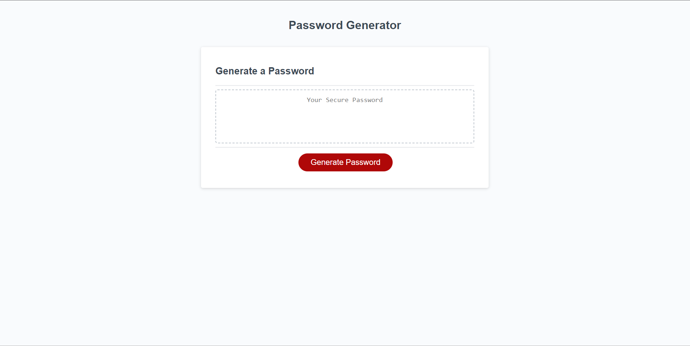

# JavaScript Password Generator
## Description
This is a javascript password generator that allows you to select if you want to include lowercase, uppercase, numerical, and special characters. It also allows you to specify a password length from 8-128, based on all of your input it generates a password accordingly
## Dependencies
Any web browser
## Installing 
N/A
## Authors
Blayne Fuller
## License
Refer to Github Repository
## Acknowledgements
Code Snippets that helped alot
- https://stackoverflow.com/questions/69851109/js-password-generator-character-length-not-working
- https://codepen.io/FlorinPop17/pen/BaBePej?editors=0010
## Preview

## Live URL: https://blayne-04.github.io/JS_PWGEN/

## UNFINISHED
currently the generator has all of the functions and arrays in place to make the final loop but the logic behind the final loop eludes me.
